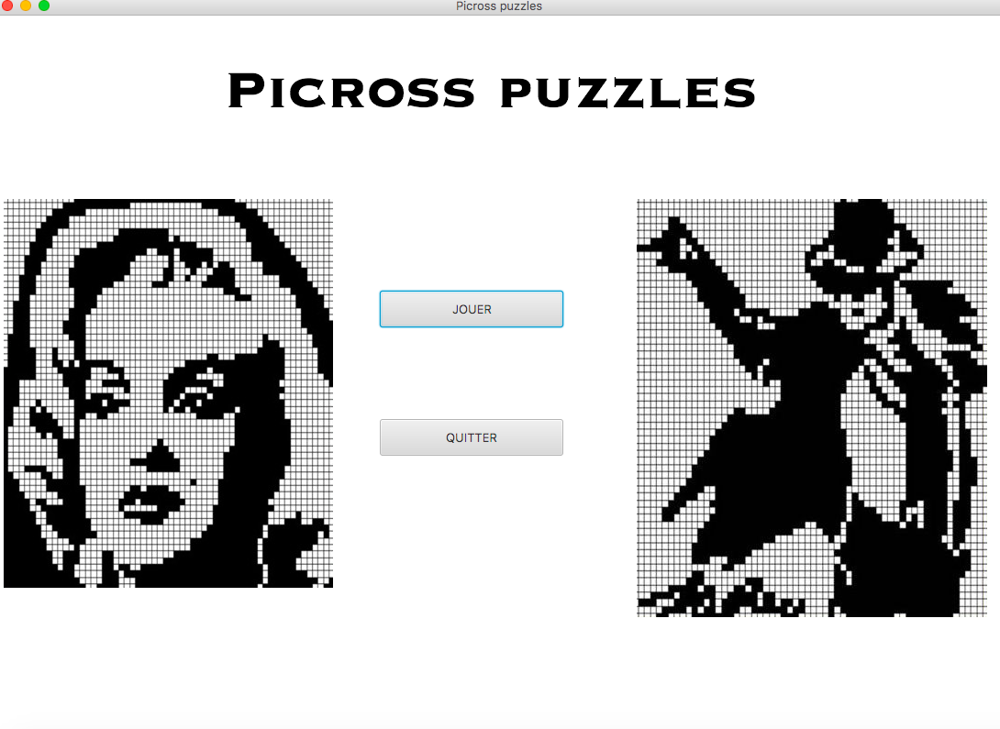
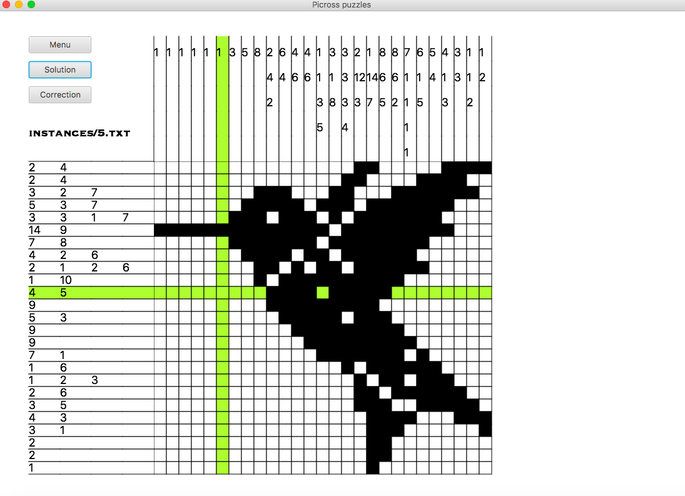
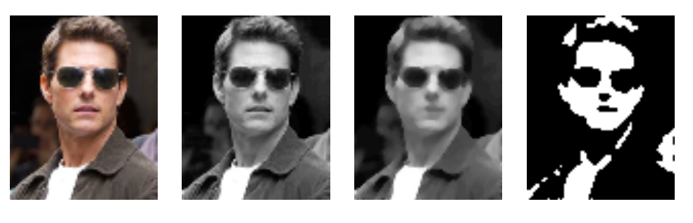

# PicrossPuzzle
The goals of this project is (1) to create a efficient solver for picross puzzle with the dynamic programming, (2) an interface to play with JavaFx, the possibility to load a puzzle with a text format or an image (3), indeed the possibility to generate a new puzzle from an image chosen by users.

## An special interface for playing 

## Generation of new picross puzzle from an image
For generate a new puzzle, we follow the steps:
1. change the dimension of the image
2. transform to shade of gray image (0->255)
3. apply a median filter to reduce noises
4. transform to black and white image with a special threshold 
5. check if this puzzle deducted is solvalbe by the solver, otherwise modify the puzzle until it become solvable (add black cell) 

